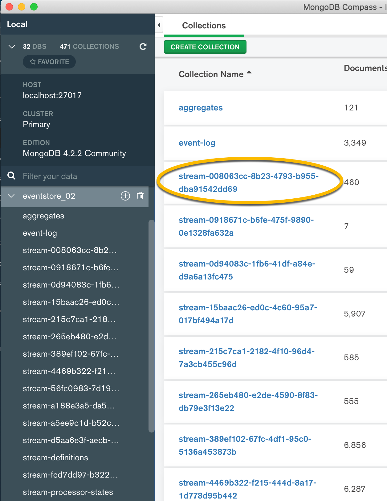
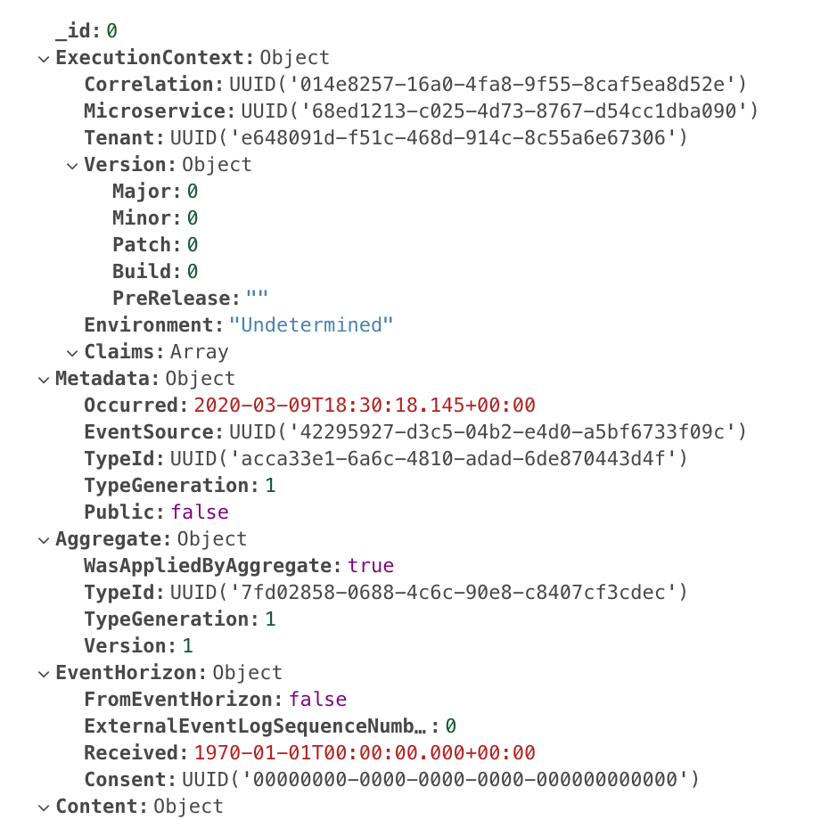

# Version 4 to 5

In this guide you'll find a comprehensive walkthrough of what you have to do to upgrade
your solution to version 5 of Dolittle. You'll also find a few tips & tricks as well as
guidance to keep in mind when developing using Dolittle.

**If you're looking to migrate a version 3 or 4 of an existing event store, please go [here](../../Runtime/EventStore)
for more details.**

## Intro

We are committed to backwards compatibility and strive towards not having breaking
changes in our APIs. With version 5 this is also true, but we've made some underlying
architectural changes that has caused some breaking changes.

The biggest change with version 5 is that you no longer compile all the capabilities
into your solution. Parts have been formalized into a separate a `Runtime` component in the
form of a [Docker image](https://hub.docker.com/r/dolittle/runtime)
that needs to be running. The SDK is then connecting to this using [gRPC](https://grpc.io).
Since all calls that involves the `Runtime` component having to work is now out-of-process
and inherently asynchronous in nature, there are things that would've "just worked" before
that does not work in the same way anymore. This is usually related to things like web requests
carrying the payload of a command, once entering an AggregateRoot, the events and processing
of these is handed over to the runtime and it will call back to your code. This means that
the async context in .NET is different and things you might have relied on to be there, might
not be there.

The implication of this is typically that you need to add more to your events so that your
event handler has access to it. From an event design perspective, this is more accurate and
is considered best practice - as it will help you guarantee idempotency within your solution.
Having to rely on transient data from a runtime context or in-memory state will not make it
possible to replay events if needing. And this is a capability that is very powerful with
version 5 and with its stream thinking, you could find yourself creating new streams for
different purposes and then not have access to all the information you need to leverage the
stream capabilities.

The reason we're doing this change is to be able to maintain a separate Microservice and
Event oriented runtime component that can be maintained and versioned separately. In a 
running distributed system, this is the component that does the heavy lifting and can
therefor be separately patched without having to recompile any application code.
Another clear benefit with this approach is the ability to offer SDKs
for different programming languages.

## Versions

If your solution consists of multiple different projects, you might want to
consider having a common `props` file for the properties and versions of dependencies
that are common. This can then be [imported](https://docs.microsoft.com/en-us/visualstudio/msbuild/import-element-msbuild?view=vs-2019) into your projects.
The benefit of this is that you maintain the versions in one place.

An example of this could be to add a `versions.props` file to the root of your solution
and add something like the following:

```xml
<Project>
    <PropertyGroup>
        <DolittleFundamentalsVersion>5.0.0</DolittleFundamentalsVersion>
        <DolittleAspNetCoreVersion>8.0.0</DolittleAspNetCoreVersion>
        <DolittleSDKVersion>5.0.0</DolittleSDKVersion>
        <DolittleReadModelsMongoDBVersion>5.0.0</DolittleReadModelsMongoDBVersion>
        <DolittleMachineSpecificationsVersion>3.0.13</DolittleMachineSpecificationsVersion>
        <MicrosoftExtensionsVersion>3.1.2</MicrosoftExtensionsVersion>
        <SystemServiceModelVersion>4.7.*</SystemServiceModelVersion>
        <MicrosoftAspNetCoreVersion>3.1.2</MicrosoftAspNetCoreVersion>
    </PropertyGroup>
</Project>
```

You can find this file [here](./versions.props).

## .NET Core and ASP.NET Core

Everything in version 5 has been updated to using either [netstandard2.1](https://devblogs.microsoft.com/dotnet/announcing-net-standard-2-1/) and for ASP.NET Core; [netcoreapp3.1](https://docs.microsoft.com/en-us/aspnet/core/migration/30-to-31?view=aspnetcore-3.1&tabs=visual-studio).

### Program / Main

The booting procedure for Dolittle has changed a lot and is much more in
alignment with how .NET Core and the host builder works.
Typically with a .NET Core App 3.1 setup, you will have a `Program.cs`
that looks like the following:

```csharp
public class Program
{
    public static void Main(string[] args)
    {
        CreateHostBuilder(args).Build().Run();
    }

    static IHostBuilder CreateHostBuilder(string[] args) =>
        Host.CreateDefaultBuilder(args)
            // Add this for Dolittle
            .UseDolittle()
            .ConfigureWebHostDefaults(webHostBuilder =>
            {
                webHostBuilder
                    .UseKestrel()
                    .UseContentRoot(Directory.GetCurrentDirectory())
                    .UseStartup<Startup>();
            });
}
```

### IoC Container

Since the configuration of Dolittle happens so early. The setup for the IoC container
is simplified. Firstly, the IoC is automatically discovered as before - and
out of the box, Dolittle only supports Autofac. You can however write your own implementation
of any IoC by implementing the interface `ICanProvideContainer`. An example of this
would be to look at the [Autofac implementation](https://github.com/dolittle/DotNET.Fundamentals/blob/master/Source/DependencyInversion.Autofac/ContainerProvider.cs).

With version 4 you had to have a line that configured Dolittle in the `ConfigureContainer`
method in your `Startup` class. This is no longer needed.
You can instead use the `ConfigureContainer` method to add addtional explicit bindings if you'd
like.

### Logging

With version 5, the internal logging mechanism has changed to be more aligned with the
.NET Core infrastructure for this and also honor the configuration and loglevels set.
It is recommended to configure logging as soon as possible, before you call `UseDolittle()`
in `Program`.

Below is an example using [Serilog](https://serilog.net).

```csharp
public class Program
{
    public static void Main(string[] args)
    {
        var builder = new ConfigurationBuilder()
            .SetBasePath(Directory.GetCurrentDirectory())
            .AddJsonFile("appsettings.json", true, true)
            .AddJsonFile($"appsettings.{environmentName}.json", true, true)
            .AddEnvironmentVariables();
        var configuration = builder.Build();

        var loggerConfiguration = new LoggerConfiguration()
            .Enrich.FromLogContext()
            .Enrich.WithExceptionDetails()
            .WriteTo.Console();

        Log.Logger = loggerConfiguration.CreateLogger();

        CreateHostBuilder(args).Build().Run();
    }

    static IHostBuilder CreateHostBuilder(string[] args) =>
        Host.CreateDefaultBuilder(args)
            // Add this for Serilog 
            .UseSerilog(Log.Logger)
            .UseDolittle()
            .ConfigureWebHostDefaults(webHostBuilder =>
            {
                webHostBuilder
                    .UseKestrel()
                    .UseContentRoot(Directory.GetCurrentDirectory())
                    .UseStartup<Startup>();
            });
}
```

### Docker Packaging

If you're building your solution using Docker, you should update the base images used
for your build context and your runtime context.
We recommend using the following:

- Build Context: mcr.microsoft.com/dotnet/core/sdk:3.1
- Runtime Context: mcr.microsoft.com/dotnet/core/aspnet:3.1

## Tenancy

In version 4 we had the concept of a tenancy resolver that could be implemented for
controlling how to resolve the tenant identifier in the current context.
This has been removed, and we recommended to either use the built-in middleware
for ASP.NET Core that we provide or build your own.

If you want to use the built-in one, put the following line of code within the
`Configure` method in `Startup.cs` - preferable as soon as possible, to make sure
all requests are included for setting the Dolittle Execution Context correctly:

```csharp
app.UseDolittleExecutionContext();
```

If you want to provide your own mechanism for setting the correct tenant, for instance
based on claims. You could quite easily implement this:

```csharp
public class ExecutionContextMiddleware
{
    RequestDelegate _next;
    IExecutionContextManager _executionContextManager;

    public ExecutionContextMiddleware(
            RequestDelegate next,
            IExecutionContextManager executionContextManager)
    {
        _next = next;
        _executionContextManager = executionContextManager;
    }

    public Task InvokeAsync(HttpContext context)
    {
        var claim = httpContext.User.Claims.First(c => c.Name == "tid"); // looking for a claim name of 'tid';
        if( claim )
        {
            var tenantId = Guid.Parse(claim.Value);
            var claims = new Claims(context.User.Claims.Select(c => new Claim(c.Type, c.Value, c.ValueType)));
            _executionContextManager.CurrentFor(tenantId, CorrelationId.new(), claims);
        }

        return _next.Invoke(context);
    }
}
```

## API Changes

### Namespaces

All namespaces that used to have `Dolittle.Runtime` in it is now only has `Dolittle`.

### Aggregates

If you're migrating from version 3, you'll notice that the interface `IAggregateRootRepositoryFor<>`
is gone. This is replaced with `IAggregateOf<>` and has a new API for working with aggregates.
The first thing you'll notice is the formalization of the difference of creating a new object and
the continuation of an aggregate.

After you've done either a create or a rehydrate of the object, you can perform actions on
the aggregate. The API gives you back an object that contains the method `Perform()` that takes
an `Action` that allows you to declaratively tell which method to call with the parameters coming
typically from the command and passed into it.

#### Create

Creating a new instance is done in the following manner.

```csharp
public class MyCommandHandler : ICanHandleCommands
{
    IAggregateOf<MyAggregate>   _myAggregate;

    public MyCommandHandler(IAggregateOf<MyAggregate> myAggregate)
    {
        _myAggregate = myAggregate;
    }

    public void Handle(DoStuff command)
    {
        _myAggregate
            .Create(command.Id.value)
            .Perform(_ => _.DoStuff(command.SomeInput));
    }
}
```

#### Rehydrate

Rehydrating and perform additional tasks on an instance is done in the following manner.

```csharp
public class MyCommandHandler : ICanHandleCommands
{
    IAggregateOf<MyAggregate>   _myAggregate;

    public MyCommandHandler(IAggregateOf<MyAggregate> myAggregate)
    {
        _myAggregate = myAggregate;
    }

    public void Handle(DoMoreStuff command)
    {
        _myAggregate
            .Rehydrate(command.Id.value)
            .Perform(_ => _.DoMoreStuff(command.SomeInput));
    }
}
```

## Events

Its within everything events the biggest changes are.
The entire handling of events, storing them and then how they are distributed
to other microservices through the Event Horizon that was first introduced as
a concept in version 3.

### Event Store

The Event Store is built from the ground up and sits as the first step in the
pipeline when committing an event. The event is then stored in the event log.
Asynchronously from this, whenever events appear in the event log - filters are
running with these. If a filter for the event going through decides it is
interested in the event - the event is automatically appended to a stream identified
by the filters unique identifier.

### Streams

Streams are front and center for everything events within the runtime.
As mentioned earlier, filters decide whether or not an event should be in a stream.
A stream is an immutable definition of what events are in it - with an append only
behavior. This means a filter can't change its definition if there are existing events
that will be included by the new filter definition. This is what we mean by append only.
New events that has not appeared in the event log after the definition changed will
be accepted.

### EventHandlers instead of EventProcessors

In version 4 and prior, there was the concept of an event processor.
It was built around two pieces; implementing the interface `ICanProcessEvents` and by 
convention one or more `Process()` methods taking the event as an argument and adorning
it with the attribute `[EventProcessor()]`.

You'd have something like this:

```csharp
public class MyEventProcessor : ICanProcessevents
{
    [EventProcessor("008063cc-8b23-4793-b955-dba91542dd69")
    public void Process(MyEvent @event)
    {
        // Process....
    }
}
```

With this, we looked at each individual method as a unique event processor and lacked
partitioning - which lead to problems with guaranteeing ordering and correct replay
of events.

In version 5 this has been completely taken out and replaced with something called
EventHandlers. EventHandlers are in fact a specialized type of filter that filters
based on the types the implementing class can handle. This filter definition is what
is used to define the stream. The first parameter for the attribute is
the unique identifier of the event handlers stream.

```csharp
[EventHandler("008063cc-8b23-4793-b955-dba91542dd69")]
public class MyEventHandler : ICanHandleEvents
{
}
```

### Public events

In version 5 there is a formalization around what constitutes a public event. These
are often different in shape than your private events and may need to have more or other
information on them in order for external parties to make sense of them.

The first thing you'll need is to implement the interface `IPublicEvent` to let the
SDK know what are marked as potential public events.

```csharp
using Dolittle.Events;

public class MyPublicEvent : IPublicEvent
{
}
```

For public events to actually be made public there is a filter mechanism you **have** to provide to select
which events should go public. There is currently no way to ignore having a filter, even if you want all
public events to go public.

By implementing the interface `ICanFilterPublicEvents` and adorning the class with a `[Filter([guid])]` attribute,
the SDK will discover your filter and call it for any potential public events.

If you want to allow all public events, you can provide a simple filter like below:

```csharp
using Dolittle.Events;
using Dolittle.Events.Filters.EventHorizon;

[Filter("606b0fc0-bd69-4034-9dcc-c142e38f484a")]
public class AllPublicEvents : ICanFilterPublicEvents
{
    public Task<PublicFilterResult> Filter(IPublicEvent @event, EventContext context)
    {
        return Task.FromResult(new PublicFilterResult(true, PartitionId.Unspecified));
    }
}
```

All the events will then be added to a public stream with the identifier given to the filter attribute.

### Scopes

When a microservice gets events over the event horizon from another microservice, it needs to put these
into a stream that is not the main event log. Since the events coming from the other microservice is not
yours, you tell the runtime which scope - a special purposed stream - the events should go into.

### Configuring event-horizons.json

Within your applications startup project, inside the `.dolittle` folder where you have other Dolittle related
configuration files, you will be needing a file called `event-horizons.json`.
The purpose of this file is to configure which microservices you're interested in events from.

The file consist of a key/value pair of `tenant identifier` defining the source tenant to a configuration
object that holds information about which microservice to get from and into which scope, stream, target tenant
and partition.

```json
{
    "abcfc9dd-9c9b-42a1-bb9d-277e7dcb0a86": [
        {
            "scope": "e8c46458-2388-4a78-8a0f-33f5d066a106",
            "microservice": "afa51d6e-8851-49ca-b294-884a033d2160",
            "tenant": "445f8ea8-1a6f-40d7-b2fc-796dba92dc44",
            "stream": "386c5e44-fc7f-461b-a0d2-4a466a91f054",
            "partition": "abcfc9dd-9c9b-42a1-bb9d-277e7dcb0a86"
        }
    ]
}
```

Recommend looking at the [configuration sample for multiple microservices](./MultipleEnvironment) for a complete
runtime configuration of two runtimes.

### Configuring event-horizon-consents.json

On the producing microservice, you need to consent to the microservice that wants public events from you.
This is done through the `event-horizon-consents.json` file.

The file conists of a key/value pair of `tenant identifier` to configuration object that tells which microservice
for which `tenant identifier` from what stream and partition and an identifier of the consent object itself.

```json
{
    "900893e7-c4cc-4873-8032-884e965e4b97": [
        {
            "microservice": "afa51d6e-8851-49ca-b294-884a033d2160",
            "tenant": "900893e7-c4cc-4873-8032-884e965e4b97",
            "stream": "2c087657-b318-40b1-ae92-a400de44e507",
            "partition": "00000000-0000-0000-0000-000000000000",
            "consent": "1decd852-3743-4fe8-be01-bb4e76d70ec2"
        }
    ]
}```

Recommend looking at the [configuration sample for multiple microservices](./MultipleEnvironment) for a complete
runtime configuration of two runtimes.


### Configuring microservices.json

The runtimes that are connecting to other runtimes need to be able to map from the identifier of the microservice
to where it actually is. This is done by giving a `microservices.json` file to the runtime.

The file consists of a key/value pair of `microservice identifier` to configuration object that tells it which host
and port the microservice is on.

```json
{
    "67297c78-7934-401f-a000-74810a8aca49": {
        "host": "localhost",
        "port": "50052"
    }
}
```

Recommend looking at the [configuration sample for multiple microservices](./MultipleEnvironment) for a complete
runtime configuration of two runtimes.

### Handling external events

```csharp
using Dolittle.Events;
using Dolittle.Events.Handling.EventHorizon;

[EventHandler("cf12eb62-444a-42db-8547-fd9d9f318ff4")]
[Scope("e8c46458-2388-4a78-8a0f-33f5d066a106")]
public class MyExternalEventsHandler : ICanHandleExternalEvents
{
    public Task Handle(OtherMicroserviceEvent @event, EventContext context)
    {
        return Task.Completed;
    }

}
```

### Migrating an existing event store

If you already have events in a version 4 or earlier type of event store, you need to
migrate this. We have a NPM package that can be used to help you achieve this.
Read more about it [here](../../Runtime/EventStore).

## Runtime

In version 5, the Runtime is no longer an in-process component of your solution.
It has been separated out and you need it to be running and the SDK connecting
to it.

The easiest way to run it locally is to grab the [Docker image](https://hub.docker.com/r/dolittle/runtime)
and configure it properly. Recomment looking [here](./SingleEnvironment) for an
example of how to configure it running.

### Additional programming languages

With version 5 and the separation of the runtime we've enabled the scenario of
multiple programming languages. This is done through exposing a gRPC API surface from
the runtime, enabling anything to connect to.

The recognize that the raw gRPC surface is probably not very helpful, and is therefor
working on providing more language idiomatic SDKs for working with the runtime.
First one out is our NodeJS / JavaScript SDK.
You can find it on NPM [here](https://www.npmjs.com/package/@dolittle/sdk).
It is maintained on GitHub [here](https://github.com/dolittle/javascript.sdk).
In the repository you'll a couple of [samples](https://github.com/dolittle/JavaScript.SDK/tree/master/Samples).

## Configuration

### Resources

With version 4, all resources were owned by the Dolittle SDK and configured for the same
process of your running code. In version 5 with the formalization of the runtime as a separate
running process / instance, all configuration related to the event store should therefor
come out of the `resources.json` file in the `.dolittle` folder siting typically in the startup
project of your microservice. This should then be moved into a `resources.json` file that then
sits together with the runtime.

If you have a `resources.json` that looks like below:

```json
{
    "bb71d84c-e82d-4694-8252-2bc94123eb92": {
        "readModels": {
            "host": "mongodb://localhost:27017",
            "database": "readmodels",
            "useSSL": false
        },
        "eventStore": {
            "host": "mongodb://localhost:27017",
            "database": "eventstore",
            "useSSL": false
        }
    }
}
```

You want to extract the **"eventStore"** key and content and copy it into the `resources.json`
file for the runtime.

You'd then end up with the following your solution:

```json
{
    "bb71d84c-e82d-4694-8252-2bc94123eb92": {
        "readModels": {
            "host": "mongodb://localhost:27017",
            "database": "readmodels",
            "useSSL": false
        }
    }
}
```

And this for your runtime:

```json
{
    "bb71d84c-e82d-4694-8252-2bc94123eb92": {
        "eventStore": {
            "host": "mongodb://localhost:27017",
            "database": "eventstore",
            "useSSL": false
        }
    }
}
```

### Event Horizon

With version 5, the configuration of event horizon has changed. The concept of consent has been introduced,
meaning that the microservice and its runtime that holds events that other microservices are interested in
needs to consent explicitly to the microservice connecting for the tenant it wants events for and for a specific scope.

The runtime looks for a file called `event-horizon-consents.json` in the `.dolittle` folder.

## Tips and Tricks

### Development environment

Leveraging [docker-compose](https://docs.docker.com/compose/) you can make a consistent development environment for your
microservice(s). You can find an example of how you could set up a single microservice environment [here](./SingleEnvironment)
and for a multi-microservice setup; [here](./MultipleEnvironment).

With Docker compose, you can now simply run the following from your terminal from the folder of your environment:

```shell
$ docker-compose up
```

A tip would then be to have a folder called `Environment` at the root of the repository and keep the files there for
everyone on the team to use.

Docker compose will also retain the database state between runs, unless you explicitly do `docker-compose down` in a terminal
in the folder of your environment.

### Navigating the event store

There has been an effort in structuring how the events are stored within MongoDB to make it
human readable.

In your favorite MongoDB tool, you will notice there are a few collections.

| Nane | Description |
| ---- | ----------- |
| aggregates | If your system has aggregates, this is holding version information about aggregates for concurrency purposes |
| event-log | This is the main event log where all the events are stored |
| stream-definitions | Holds information about the different definitions of streams |
| stream-processor-states | Holds status, positioning and possible failed partitions with reasons for every processor in the system |
| stream-[guid] | Every stream sits with its own unique identifier added to the name |

Below you can see how it looks in MongoDB Compass and how a specific streams collection is named:



Every event you can expand and look at all the execution context, metadata, aggregate, event horizon and content:



### Failed partitions

In the `stream-processor-states` collection you can find the current status; whether it has failed or not, the current position
the processor has (typically your event handler). If it has any failures, it holds an array of failed partitions.
The partitions is by default for an event handler the unique identifier of the event source.

## Guidance

### Nullables on events

Nullable values are not supported on events. If you introduce a property that is missing on
already committed events, while replaying these - the SDK will fail for the event handler /
processor due to serialization issues with the missing property. The serializer is not capable
of distinguishing nullables from non-nullables and requires a value for it.

### Events, replay and idempotency

The concept of [idempotency](https://en.wikipedia.org/wiki/Idempotence) is important
when working with event driven systems. It speaks about the ability of applying the
same operations multiple times and getting the same result. This means that capturing
the properties you need on the events to be able to guarantee this is important.
Any transient state that sits in-memory or is part of an execution context in any way,
is not something that should be relied on.

Since events can be replayed this becomes very important, especially with the way we do
streams and the processing of events from these. Whenever you add a new event handler
that handles events already there, they will copied to the stream of this new event handler
and played for the handle methods. This is a completely asynchronous out of context
action and it is therefor vital that information is on the events.

Another benefit of making this explicit is that you get well formed events that tell a story.

If you have event processors / event handlers that work with a database and handles an
event by explicitly creating entries in the database, you should consider moving to using
the idea of **upsert** (insert or update). This will then help you enable replay scenarios
without creating duplicates in the database, If an entity is already there, just update it.
MongoDB has this concept built in and is called `upsert` - you can find more details [here](https://docs.mongodb.com/manual/reference/method/db.collection.update/).

### Events from other microservices

Since your system is not the owner - or creator - of the events coming from another microservice,
but they might have enough significance for you to want to keep a copy in your own event store and main event log.
You can simply take a dependency to the interface `IEventStore` and use the `Commit()` methods to do so.

Often however, the information coming from another microservice is not exactly how you want to model
your private events. You would typically then model explicitly your own needs or reuse event types you
already have and copy the necessary information over to those and then commit it to the event store.
This is often the case when you are modelling invariants explicitly as aggregate roots and have to
guarantee the consistency.

### ExecutionContext

The execution context that exists in Dolittle, holds information that is relevant to
the current running execution path. It supports the asynchronous model of .NET Core and
makes sure to provide a unique execution context the the asynchronous context you're in.
This context is also captured and sent along to the runtime when interacting with it.
For events, parts of the execution context is even stored together with the events.

Within the execution context, you'll typically find the current claims for the current
identity, similar to what you'd find on `HttpContext` and the `User` object.

In order for the state to be correct, the execution context has to be established.
On it, you'll find information such as Tenant, Environment (Production, Development, ...),
Claims and Microservice identifier. These can prove vital for the system to be working
properly. This holds true especially for Tenant, as the runtime uses the tenant information
to connect to the correct even store to store events.

## Known issues

### Client Libraries

If you're leveraging the automatic proxy generation, we have discovered an inconsistency
in the generated proxies with what is the latest version of the client libraries.
Due to this, it is recommended that you stick with following versions:

- [Commands, 1.0.15](https://www.npmjs.com/package/@dolittle/commands/v/1.0.15)
- [Queries, 1.0.16](https://www.npmjs.com/package/@dolittle/queries/v/1.0.16)
